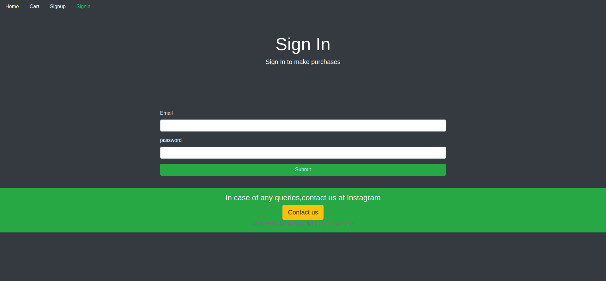

# Tshirt E-Commerce Web App
An E-commerce website made using Django REST Framework in backend and React in frontend
Used Bootstrap 4 for styling.
**Special Thanks to Hitesh Chaudhary**

**To install :**

- Frontend:
1. Download and copy the client folder in your desired location
2. Make sure you have Node.js installed
3. Run the following command : `npm install`

- Backend:
1. Download and copy the server folder in your desired location
2. Make sure you have pipenv installed
3. Run the following command : `pipenv install`

-Starting the App:
1. Move to the ecom directory inside the server folder in terminal
2. Run the following command at the terminal : `python3 manage.py runserver`
3. Move to the client directory in terminal  and run the follwing command : `npm start`

## Some screenhots of the website :

### Home Page :

### Sign In Page :

### Sign Up Page :

### Cart Page :

### User Dashboard Page :

